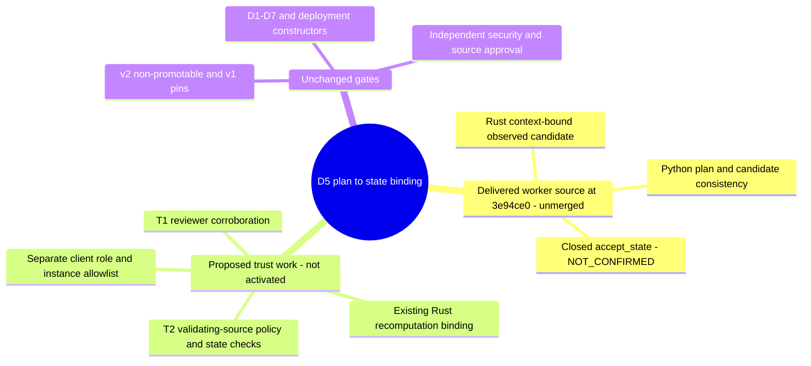

# D5 Trusted-Source Model: Proposed Variants

Date: 2026-10-10. **Design proposal only; no trust model is activated.**
Epic: [#276](https://github.com/NeaBouli/prometheus-/issues/276).
Architecture node: [MAP M1/MS-B](MAP.md), reviewed deployment plan -> genesis
identity -> observed candidate -> off-chain state acceptance (currently closed).
This completes the bounded K2 specification, not independent security review,
D5 acceptance, contract-v2 integration, deployment or production readiness.

## 1. Verified Baseline

- Public main at `251307a4dbcd76b7c7be2f770591082f758fd6b5` contains the
  reconciled public status, not the unmerged D5 implementation.
- The inspected worker baseline is C2
  [`3e94ce0`](https://github.com/NeaBouli/prometheus-/commit/3e94ce0fa81591d2a0e23758dfc46a735a8b8a92).
  Its [D5 design record](https://github.com/NeaBouli/prometheus-/blob/3e94ce0fa81591d2a0e23758dfc46a735a8b8a92/docs/architecture/d5-genesis-binding-design.md)
  and [draft validator](https://github.com/NeaBouli/prometheus-/blob/3e94ce0fa81591d2a0e23758dfc46a735a8b8a92/scripts/silverc_genesis_binding_draft.py)
  are source evidence, not accepted deployments.
- Rust candidates are context-bound observations from one configured node.
  Their schema-1 status stays `OBSERVED_NOT_INDEPENDENTLY_CONFIRMED`, with
  `NOT_CHAIN_PROOF`, `NOT_D5_ACCEPTANCE`, `NOT_DEPLOYMENT_AUTHORIZATION`.
- Python `validate_genesis_binding` checks draft plan/candidate consistency;
  `accept_state` unconditionally raises `NOT_CONFIRMED`. No activation switch
  exists. Python does not call the Rust covenant-ID recomputation command.
- K1 independently reviewed `61549b1`, not all later deltas. C2 CI
  [37988100086](https://github.com/NeaBouli/prometheus-/actions/runs/37988100086)
  and Security Audit
  [37988101662](https://github.com/NeaBouli/prometheus-/actions/runs/37988101662)
  passed at `3e94ce0`; CI/runtime success is not source-trust approval.
- v2 remains non-promotable; the Rust release pins accept only historical v1.
  H-001 evidence stays frozen and is not a D5 reconstruction anchor.

## 2. What Each Check Can Establish

The pinned [Kaspa covenant-ID implementation](https://github.com/kaspanet/rusty-kaspa/blob/cfafeb4c093fa37a303f1b9f19c58f986b870ce3/consensus/core/src/hashing/covenant_id.rs)
binds a funding outpoint and authorized output fields, excluding the covenant
binding itself. Reuse that implementation; do not create a second hash engine.
Recomputation identifies the reviewed initial script/value, not chain presence.

The [pinned RPC types](https://github.com/kaspanet/rusty-kaspa/blob/cfafeb4c093fa37a303f1b9f19c58f986b870ce3/rpc/core/src/model/message.rs)
return UTXO entries and DAG information including network, virtual DAA score
and pruning point. They do not themselves constitute a portable UTXO proof.
This is the exact `v2.0.1` revision resolved in the main `Cargo.lock`; upgrading
it is a separate compatibility/pinning task, not part of this proposal.

| Check | Can establish | Does not establish |
|---|---|---|
| Hash of normalized observation | Integrity/consistency of stored fields | Who supplied them, truth, freshness |
| Reviewer recaptures a query | Acquisition independent of the deployment operator | Consensus truth if the provider is dishonest |
| Two different URLs | Two access paths | Different operators, backends or control domains |
| Two independently administered validating nodes | Corroboration under the declared node/operator assumptions | Trustlessness or immunity to shared software/network failure |
| Matching header/hash | Agreement about a block under the source model | Acceptance of its transactions, current UTXO membership |
| Virtual DAA minus UTXO DAA | A score distance and chronology check | A confirmation count, elapsed seconds or finality |
| Reviewed plan and recomputed covenant ID | Expected initial instance identity | That this instance was deployed or remains unspent |

The limitations above are design conclusions, not newly discovered live bugs.
An isolated header check must not be described as an SPV/consensus verifier.

## 3. Variants and Recommendation

| Variant | Trust and collection | Permitted interpretation | Trade-off |
|---|---|---|---|
| T0: current candidate | One operator-configured node, context-bound snapshot | Observed only; no acceptance | Already delivered, cheapest, no independent provenance |
| T1: reviewer corroboration | Operator source plus separately administered validating source, independently queried by reviewer | Corroborated observations under named trust assumptions; not cryptographic chain proof | Practical development milestone; source independence must be demonstrated privately |
| T2: validating-node-backed acceptance | Reviewer-controlled validating node with reviewed network/bootstrap policy, independent second validating source, locally checked genesis/acceptance/current state | Future acceptance only under the approved explicit trust policy and full security gates | Stronger operational assurance; requires node capacity/access and independent review |
| T3: portable consensus/UTXO proof | Independently evaluated proof mechanism binding network, accepted genesis and state | Target research, no current proof claim | No supported implementation established in this block; do not invent one |

**Proposed order:** retain T0; prepare T1 collection for development; require a
separate T2 decision before any D5 runtime acceptance. Do not implement T3
merely to remove a blocker. T1 alone does not authorize changing
`independently_confirmed` or opening `accept_state`. An explorer may be a
supplemental source, not a substitute for an approved validating source.

No provider, node purchase, hosting change or numerical acceptance threshold
is selected here. T2 is a recommendation for review, not an owner approval.

## 4. Policy Must Be Pinned Before Capture

The proposed policy is separate from immutable candidate schema 1. It must
be reviewed/pinned out of band, never trusted from a candidate's own fields.
Any future corroboration wrapper needs its own schema/review; it cannot
silently rewrite candidate classifications or add optional bypasses.

- Exact network/subnetwork, pinned consensus parameters and genesis identity
  from the reviewed toolchain; no identity inference from an address prefix,
  endpoint name, TLS certificate or a provider's `network` string alone.
- Exact release/compiled identity, constructor arguments and authority keys;
  placeholder v2 fixtures are not deployment constructors.
- Source-control domains and reviewer acquisition responsibility. Different
  machines/URLs/certificates are insufficient. Shared hosting/backend/control,
  mirrored explorer indexes and a common upstream RPC must be recorded as
  dependence. Unknown independence blocks corroboration.
- Bootstrap/checkpoint provenance and software pins for validating sources.
  A matching genesis alone does not rule out a fork/eclipsed view.
- Required current-state/accepted-genesis checks, observation age, inter-source
  capture gap, permitted tip skew, minimum reviewed DAA score distance and
  recheck policy. Values require review; none are inferred from BPS or `<60 s`.
- Exact source/policy change and revocation rules. No automatic provider
  substitution, retry-to-weaker-source or permissive default on timeout.

Public documents contain opaque source-role labels and policy commitments,
not endpoint URLs, IPs, account names, host identities or private attestations.
Labels/hashes are audit pointers, not proof of independence. The authorized
reviewer checks private provenance; no self-declared boolean is authoritative.

## 5. Proposed Validation Order

This is a future acceptance contract, **not implemented execution**.

1. Reject non-promotable/unknown bundle identities before file or network I/O,
   preserving the existing v2 early gate and immutable historical profile.
2. Validate strict bounded document shape and integer types; obtain reviewed
   policy/plan/compiled-identity pins from trusted inputs, not the evidence.
3. Bind all roles, constructor keys, network and deployment-specific artifacts;
   reject placeholder substitutions and cyclic trust graphs by existing policy.
4. Recompute each covenant ID using the existing Rust/Kaspa helper. The Python
   caller must bind exact artifact/script hashes, funding outpoint, value and
   index; a copied calculation JSON is not independent recomputation.
5. Check candidate hashes/relations and every context field against the
   externally validated preparation/signing context. Retain the draft's
   current checks; hashes inside the candidate never supply authority.
6. Verify approved source independence and reviewer capture provenance, plus
   pinned network/bootstrap identity. Two operator-supplied files do not pass.
7. Check genesis transaction acceptance through the approved validating-source
   model, not block existence alone; bind its funding input, transaction ID,
   output index, value, script and covenant ID to the reviewed preparation.
8. Corroborate the current UTXO/state and chain view using the same policy.
   Bind any successor by an independently validated transition; an absent
   genesis UTXO alone is neither proof of failure nor proof of a successor.
9. Enforce chronology, capture age/gap, tip-skew and approved score-distance
   bounds. Reorg, stale/eclipsed view, disagreement, missing/pruned data or
   unavailable required source yields blocked/not-confirmed, never downgrade.
10. Bind the result to exact policy/plan/bundle/network/role/instance and source
    evidence commitments; check again at use time under the expiry/recheck
    policy. Historical genesis identity cannot authorize an unrelated live state.
11. Only a separately reviewed acceptance implementation may consume that
    result. The current unconditional `NOT_CONFIRMED` stays unchanged.
    A future client allowlist is a separate task, not authority inferred from
    an owner-signed manifest or this specification.

Disagreement must not be settled by majority voting among unknown providers.
Capture retries, if later authorized, have explicit bounds and never weaken
the policy. No signed transactions, wallet material or private node responses
are published; any future public evidence is a reviewed non-secret projection.

## 6. Adverse-Case Acceptance Matrix (Specification, Not Test Evidence)

These cases are required regressions for later implementation. They have not
been executed as a new acceptance engine; the design adds no such engine.

| ID | Input or situation | Required future outcome |
|---|---|---|
| TS01 | Single configured source with internally valid candidate | Observed only; acceptance closed |
| TS02 | Two URLs backed by the same node/provider | Independence blocked |
| TS03 | Different hosts under one administrative authority | Independence blocked unless a separately approved policy explicitly allows that weaker model; never claim independent operators |
| TS04 | Source independence cannot be substantiated | Blocked, not assumed |
| TS05 | Operator supplies both supposedly reviewer-captured files | Provenance blocked |
| TS06 | Source registry/policy commitment replaced with candidate value | Reject untrusted policy |
| TS07 | Network label matches but reviewed genesis/parameters differ | Reject network binding |
| TS08 | Matching genesis but stale/eclipsed divergent chain view | Block current-state acceptance |
| TS09 | Copied header contains deployment transaction but acceptance absent | No accepted-genesis claim |
| TS10 | Matching header without current UTXO/state validation | No current-state acceptance |
| TS11 | Candidate replaced by a self-consistent different plan/context | Reject context binding |
| TS12 | Funding outpoint/value/script/index changed together with hashes | Reject reviewed identity/context |
| TS13 | Placeholder constructors replace reviewed deployed constructors | Reject compiled identity |
| TS14 | Contract-role or covenant-ID substitution | Reject role/instance binding |
| TS15 | Required source disagrees on amount/script/covenant/acceptance | Block; no provider majority fallback |
| TS16 | Future UTXO DAA score or inconsistent score distance | Reject chronology |
| TS17 | Numerically large DAA distance from fabricated/stale source | No confirmation/finality inference |
| TS18 | Capture expired or inter-source gap/tip skew exceeds policy | Block and require authorized fresh capture |
| TS19 | Reorg after capture or before client use | Revalidate; do not use stale binding |
| TS20 | Genesis output spent, alleged successor unverified | Block successor acceptance |
| TS21 | Required data pruned, source unavailable or timeout | Block; no automatic weaker source |
| TS22 | Unknown, duplicate, missing, bool-as-integer or oversized fields | Strict rejection |
| TS23 | `independently_confirmed`, status or blocker list edited | Current `accept_state` still refuses unconditionally |
| TS24 | Complete synthetic corroboration fixture | Test/specification only, never live evidence |
| TS25 | v2-draft/unknown bundle or mixed historical/current artifacts | Existing early rejection; no export or acceptance |
| TS26 | Historical H-001 summary used as complete D5 anchor | Missing reconstruction/trust requirements remain blocked |

## 7. Bounded Follow-Up Sequence

All entries are **open/proposed**, not dispatched implementation approvals.

| Ticket | Single responsibility / boundary | Depends on / acceptance |
|---|---|---|
| D5-T1 | Model/policy decision, no runtime change | Review T1/T2 assumptions and concrete freshness/network/source policy; owner authorization for any new access/cost |
| D5-T2 | Independent-source capture specification/adaptor | D5-T1 and exact source-access approval; preserve schema-1 candidate; redact private provenance; demonstrate TS02-TS10/TS15-TS21 |
| D5-T3 | Python-to-existing-Rust recomputation binding | Accepted v2 integration/review and D5-T1; no new crypto; exact argument/output binding, error/collision tests; acceptance remains closed |
| D5-T4 | Reviewed corroboration and acceptance boundary | D5-T2/T3, applicable D1-D7/constructor/security gates and independent review; all TS cases covered; no boolean/status activation switch |
| D5-T5 | Client role/instance allowlist | D5-T4; existing `rule_observation.rs` hop; expiry/reorg/successor tests and no fallback to manifest-only authority |
| D5-T6 | Authorized Testnet-10 evidence and release adjudication | Required previous gates plus exact owner authorization; independent live capture; no Mainnet or production inference |

Local design and tests may proceed without creating nodes or querying private
endpoints. No dependency installs, toolchain upgrades, cross-contract checks,
new token behavior or endpoint response automation are bundled into D5.
Codex Security remains **NOT CONNECTED / NOT RUN** and is separate from the
green GitHub Security Audit; integration exemptions/acceptance need explicit
lead adjudication, not an inferred pass.

## 8. Scoped Visualization

The existing worker path was inspected in the pinned draft validator:
`validate_genesis_binding` -> `_bind_candidate` ->
`verify_candidate_document`; `accept_state` always refuses. Proposed source
corroboration/recomputation/acceptance are open nodes, not simulated execution.
PlantUML source: [d5-trust-boundary.puml](d5-trust-boundary.puml).

